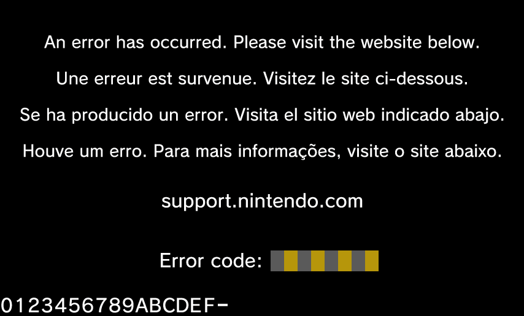

GamePad boot process
====================

This page describes the boot process of the GamePad and the initialization of
all the major devices.

(Unconfirmed) On-chip bootloader
--------------------------------

The DRC-WUP SoC most likely contains some kind of on-chip bootloader whose role
is to load the secondary boot loader from the upgradable Flash. The first 4
bytes on the SPI Flash contain the size of the bootloader as a little endian 32
bit integer. The bootloader itself is stored at offset 4 on the Flash, just
after the size, and has the following structure:

* The first 32 bytes are the interrupt vectors and will be loaded at address 0
  in RAM.
* The next ``N-32`` bytes are the bootloader code and are loaded at address
  ``0x3F0000 == RAM_SIZE - 64K``.

The entry point of this bootloader is the reset vector at address 0, which
commonly jumps to some code based at ``0x3F0000``.

Secondary bootloader
--------------------

The role of the secondary bootloader is to select which version of the firmware
on the Flash to run, then parse the on-Flash volume header to find and load
the code to memory before executing it.

On-Flash volume header
~~~~~~~~~~~~~~~~~~~~~~

Each version of the firmware on the Flash stores several blobs, which are
described by a very simple data structure found on the Flash::

    struct BlobPointer {
        le32 offset;  // from the base of the data structure
        le32 length;
        char name[4];
        le32 version;  // 0 where it doesn't make sense
    };

The first of these blobs, named ``INDX``, represents the volume header itself.
To get the number of blobs to check for, use ``INDX.length / 16``.

A few known blob names:

* ``INDX`` - the volume header itself
* ``VER_`` - version of the firmware
* ``LVC_`` - code for the DRC-WUP System on Chip (ARM9)
* ``UMI_`` - code for the UIC-WUP Processor (STM8)
* ``WIFI`` - code for the Wi-Fi dongle (Cortex-M3)
* ``ERR_`` - image to display on panic
* ``IMG_`` - general image resources

Volume header selection process
~~~~~~~~~~~~~~~~~~~~~~~~~~~~~~~

The SPL first interrogates the UIC to know if a debugging device is present on
the extension port. If it is, the SPL will load data from the volume header at
address ``0x1C00000``, which is the service firmware used for diagnostics and
repairs.

At address ``0xF000`` on the Flash, a byte is stored that represents the
version of the firmware to load. If it is 0, the SPL will load data from the
volume header at address ``0x100000``. If it is 1, the SPL will load data from
the volume header at address ``0x500000``.

LVC firmware loading process
~~~~~~~~~~~~~~~~~~~~~~~~~~~~

TODO

LVC firmware
------------

TODO: when is WIFI booted?

Image resources
~~~~~~~~~~~~~~~
The ``ERR_`` blob contains a 854x516 RGBA image encoded using a color palette.
The beginning of the blob contains a 1024 byte colormap (256 x 4 x 1 byte, for
red, green, blue and alpha). Right after the palette (at offset ``0x400``)
starts the pixel raster data. The pixels are saved row-major with 8 bit-
per-pixel (because it uses a 8-bit colormap). Each row is padded with two bits
of zero, so that the row length is a multiple of four (bmp does that too).
Basically just a bmp file, stripped of all its enconding info.

The first 480 rows of the ``ERR_`` image seem to contain the background image,
while the last 36 rows seem to contains bitmaps of hexadecimal letters:

The ``IMG_`` blob on the other hand contains multiple images (e.g the nintendo
logo) saved in a similar fashion but including encoding info (they do not use
the row padding though).
