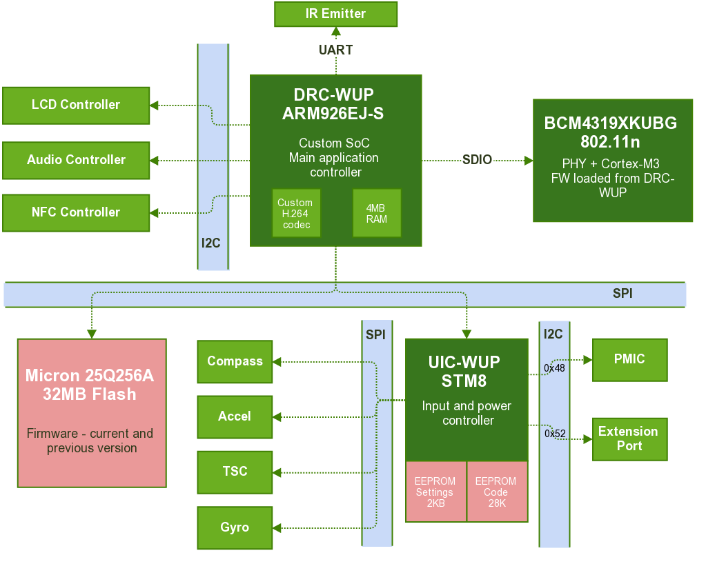

Overview of the internal workings
=================================

DRC and DRH
-----------

**DRC**
    Codename for the main Wii U GamePad CPU. It is used in this documentation
    and libdrc as a short name for the Wii U GamePad.

**DRH**
    The small part of the Wii U console that handles communication with the
    GamePad. It is very similar to the DRC internally and acts very separately
    from the rest of the console. It communicates with IOSu (the Wii U
    operating system) via USB.

Hardware
--------

The Wii U GamePad is a fairly complicated piece of hardware, containing several
important and sometimes custom ICs (including 3 CPUs).

**DRC-WUP**
    This is the main chip that runs the GamePad firmware. It is also referred
    to as "the ARM9" or "the LVC" in this documentation (LVC is the name of the
    firmware unit ran by DRC-WUP).

    This SoC is based on an ARM926EJ-S CPU and seems to be custom made for this
    device. It presents no external markings that would allow identification of
    a designed/manufacturer, but it is assumed to have been designed by
    MegaChips Corporation. The hardware H.264 decoder present inside seems to
    also be of a custom design.

    It is connected directly to some components via I2C and GPIOs, but it
    relies a lot on the UIC, which it communicates with over a SPI bus.

    It is assumed to contain a very simple boot ROM that reads a secondary
    bootloader (SPL) from the Flash. The :doc:`Boot process <boot>` section
    goes more in details about this.

**BCM4319XKUBG**
    A Broadcom Wi-Fi chip that is not so custom - it was actually used in a few
    other products, including the Boxee TV box. The firmware running on it is a
    fairly standard Broadcom SDIO chip firmware with very slight alterations
    from Nintendo. The :doc:`Wi-Fi Peculiarities <wifi>` section explains these
    changes.

    It is capable of 802.11n on 5GHz frequency bands, which is the requirement
    to communicate with a Wii U console.

    The firmware on this Broadcom chip runs on a Cortex-M3 CPU, which is
    amusingly more recent than the ARM926EJ-S running the main firmware.

**UIC-WUP**
    A small embedded chip based on an STM8 CPU. It runs its own firmware
    loaded from an on-chip EEPROM (upgradable). Its main role is to communicate
    with all the input devices (buttons, analog sticks, as well as the more
    complicated ICs like compass, accelerometer, gyroscope and touchscreen
    controller) and with the Power Management IC (PMIC) that handles power
    control on the board (battery charge, as well as status LEDs).

    It communicates with the LVC over a SPI bus (on which it is slave). A
    simple request-reply protocol is used to perform several actions.

    The UIC also has the weird function of storing some of the configuration
    settings in a 2KB EEPROM. A description of the settings stored in that
    EEPROM can be found in the `Settings EEPROM structure`_ section.

Firmware
--------

The most important part of the Wii U GamePad firmware is the ``LVC_`` part,
which contains the code running on the ARM9 CPU. This firmware is based on the
eForce operating system, a real time operating system following the `µITRON 4.0
specification`_.

.. _`µITRON 4.0 specification`: http://www.ertl.jp/ITRON/SPEC/FILE/mitron-400e.pdf

The ``ASSERT`` macros used throughout the LVC firmware code also references the
source file names, giving a good idea of the structure of the firmware code and
how it was made. There are 4 main parts in the LVC firmware:

**Drivers**
    Handle communication with the hardware as well as internal synchronization
    and callback mechanisms. The following drivers are present in the latest
    version of the Wii U GamePad firmware:

    * aamp - audio amplifier
    * acapt - audio capture
    * aout - audio output
    * blit - screen surface blit
    * cmos - video camera
    * dma - generic DMA handling library
    * evt - generic event/callback library
    * fifo - unknown
    * flash - SPI flash
    * gpio - generic GPIO management library
    * i2c - I2C controller
    * ir - infrared output
    * lcd - LCD screen controller
    * mem - unknown
    * spi - SPI controller
    * uic - SPI UIC (STM8 CPU)
    * vcapt - video capture
    * vout - video decoding and output
    * wifi - Wi-Fi networking

**Services**
    Network related processes that are either servers or clients and handle
    protocol related work: crafting and decoding packet, validating data, then
    passing it further down the stack to a manager that will handle the request
    if needed. The following services are present in the latest version of the
    Wii U GamePad firmware:

    * astrm - audio streaming protocol
    * cmd - request-reply/light RPC protocol
    * hiddat - input streaming protocol
    * msg - broadcast/inter-GamePads communication protocol
    * vstrm - video streaming protocol
    * wii - unknown

**Managers**
    Background processes often getting data from either drivers or services.
    They keep track of state and handle most of the work that is not done in
    drivers. The following managers are present in the latest version of the
    Wii U GamePad firmware:

    * cmd - takes requests from the cmd service and sends replies
    * con - handles low-level network (Wi-Fi layer)
    * devif - unknown
    * draw - handles local image drawing
    * gamectrl - unknown
    * ictag - contains a NFC stack to handle requests from the cmd manager
    * ir - handles IR communication
    * msg - handles messages from the msg service
    * nvram - handles Flash and firmware management (upgrade, etc.)
    * nwk - handles high-level network (IP/UDP layer)
    * resource - handles resource loading from the Flash
    * sound - handles sound stream playback
    * state - unknown
    * sync - unknown
    * time - unknown
    * userif - local parsing of input data (for on-GamePad applications)
    * video - handles video stream decoding and playback

**Application**
    The ``main`` part of the firmware. It is a simple state machine that
    decides what to do at every moment and what managers, services and drivers
    to initialize. 
