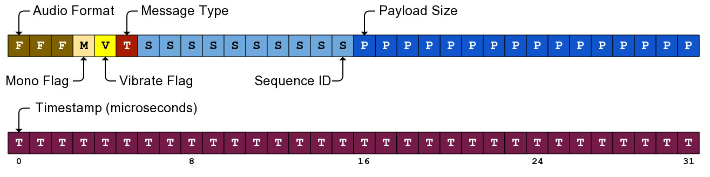

Audio streaming protocol
========================

+--------------+----------+---------------+
| Console Port | Pad Port | Direction     |
+==============+==========+===============+
| 50021        | 50121    | Console ↔ Pad |
+--------------+----------+---------------+

The audio streaming protocol, also known as ``astrm``, is used to stream game
audio data from the Wii U to a GamePad, or to stream microphone data from a
GamePad to the Wii U. It is usually uncompressed, raw samples data, but the
firmware code seems to indicate support for basic compressed formats. At of Dec
2013 compressed streaming has not been seen used in the wild.

For some reason, the ``astrm`` protocol is also used to transmit video format
and timing information.

Each packet has an 8 byte header followed by payload data: either audio or
video format information.

Protocol header
---------------

.. code-block:: c

    struct AstrmHeader {
        u16 format : 3;
        u16 mono : 1;
        u16 vibrate : 1;
        u16 type : 1;       // 0 is audio data, 1 is video format
        u16 seq_id : 10;
        u16 payload_size : 16;
        u32 timestamp : 32;
    };

Known audio formats:

* 0: PCM 24KHz
* 1: PCM 48KHz
* 2: ALAW 24KHz
* 3: ALAW 48KHz
* 4: ULAW 24KHz
* 5: ULAW 48KHz

If the packet type flag indicates that the packet is audio data, the payload
following the header is interpreted as audio samples to be played on the
GamePad. The number of samples is inferred form the payload size.

If the packet type flag indicates that the packet is video format information,
all the other header fields are ignored and the payload is interpreted as a
video format header.

Video format header
-------------------

One video format packet is sent before each video frame is sent via ``vstrm``.

.. code-block:: c

    struct AstrmVideoFormat {
        u32 timestamp;
        u32 unknown_freq_0[2];
        u32 unknown_freq_1[2];
        u32 video_format;
    };

The timestamp should match the timestamp sent in the ``vstrm`` packets for that
frame.
