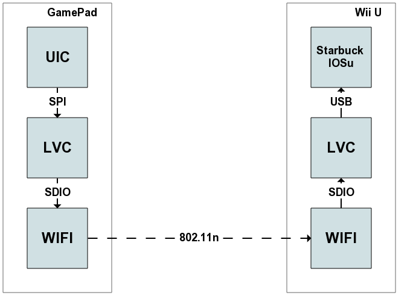

Input streaming protocol
========================

+--------------+----------+---------------+
| Console Port | Pad Port | Direction     |
+==============+==========+===============+
| 50022        | 50122    | Console → Pad |
+--------------+----------+---------------+

The input protocol, also known as HID protocol, is used to send input device
status from the GamePads to the Wii U. It is a very simple protocol: a 128
bytes blob contains the status of most input methods supported by the Wii U,
and it is sent by each GamePad 180 times per second.

The 128 bytes blob is generated on the UIC and received unmodified by IOSu on
the console.

Input data format
-----------------

.. code-block:: c

    struct InputData {
        u16 seq_id;
        u16 buttons;  // see ButtonsMask
        u8 power_status;  // see PowerStatusMask
        u8 battery_charge;
        u16 left_stick_x;
        u16 left_stick_y;
        u16 right_stick_x;
        u16 right_stick_y;
        u8 audio_volume;
        AccelerometerData accelerometer;
        GyroscopeData gyro;
        MagnetData magnet;
        TouchscreenData touchscreen;
        char unk0[4];
        u8 extra_buttons;  // see ExtraButtonsMask
        char unk1[46];
        u8 fw_version_neg;  // ~fw_version
    };

    enum ButtonsMask {
        SYNC = 0x0001,
        HOME = 0x0002,
        MINUS = 0x0004,
        PLUS = 0x0008,
        R = 0x0010,
        L = 0x0020,
        ZR = 0x0040,
        ZL = 0x0080,
        DOWN = 0x0100,
        UP = 0x0200,
        RIGHT = 0x0400,
        LEFT = 0x0800,
        Y = 0x1000,
        X = 0x2000,
        B = 0x4000,
        A = 0x8000
    };

    enum PowerStatusMask {
        AC_PLUGGED_IN = 0x01,
        POWER_BUTTON_PRESSED = 0x02,
        CHARGING = 0x40,
        POWER_USB = 0x80,  // not used on retail
    };

    struct AccelerometerData {
        s16 x_accel;
        s16 y_accel;
        s16 z_accel;
    };

    struct GyroscopeData {
        s24 roll;
        s24 yaw;
        s24 pitch;
    };

    struct MagnetData {
        char unknown[6];
    };

    struct TouchscreenData {
        // 10 points are sampled at about the same time - average them to get
        // a more accurate reading.
        struct {
            struct {
                u16 pad : 1;
                u16 extra : 3;  // See the next section.
                u16 value : 12;
            } coords[2];
        } points[10];
    };

    enum ExtraButtonsMask {
        TV = 0x20,
        R3 = 0x40,
        L3 = 0x80,
    };

Touchscreen extra data
----------------------

Each touchscreen coordinate is used to store additional information:

Touchscreen pressure
    Stored as a 12 bit integer in the extra data of the first two points. It is
    not yet known how to translate this value to a usable pressure value -
    currently it is assumed to be a resistance value reading.

UIC firmware version
    16 bit integer stored in the extra data of points 6 to 8 (only one bit of
    the first coordinate of point 6 is used).
