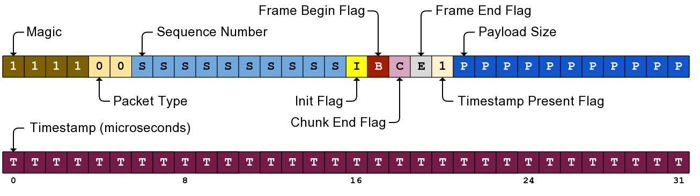
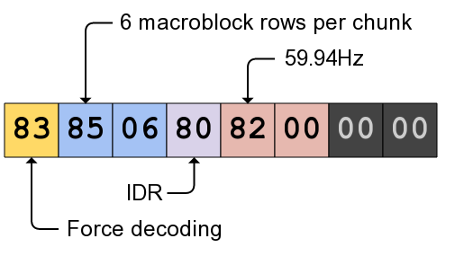

Video streaming protocol
========================

+--------------+----------+---------------+
| Console Port | Pad Port | Direction     |
+==============+==========+===============+
| 50020        | 50120    | Console ↔ Pad |
+--------------+----------+---------------+

The video streaming protocol, also known as ``vstrm``, is used to stream
compressed game video data from the Wii U to a GamePad, or to stream camera
data from a GamePad to the Wii U. It is using H.264 with a custom wrapper
around the VCL instead of NAL.

Each packet has an 8 byte header (4 is also possible but never seen), followed
by an 8 byte extended header, followed by the compressed video data.

Protocol header
---------------

.. code-block:: c

    struct VstrmHeader {
        u32 magic : 4;
        u32 packet_type : 2;
        u32 seq_id : 10;
        u32 init : 1;
        u32 frame_begin : 1;
        u32 chunk_end : 1;
        u32 frame_end : 1;
        u32 has_timestamp : 1;
        u32 payload_size : 11;

        // If has_timestamp is set (almost always)
        u32 timestamp : 32;
    };

This header is then followed by an 8 byte extended header.

Extended header
---------------

The extended header is an 8 byte area after the ``vstrm`` header where options
can be set. Each option is represented by a byte, and options are read linearly
from the extended header until either 8 bytes were read or a ``0x00`` byte was
read (signaling the end of options). Here are the known options:

+-------------+------------------+-----+-------------------------------------+
| Option Byte | Option Name      | Arg | Description                         |
+=============+==================+=====+=====================================+
| 0x00        | End              | N   | End of options.                     |
+-------------+------------------+-----+-------------------------------------+
| 0x80        | IDR              | N   | Indicated that the frame is an IDR. |
+-------------+------------------+-----+-------------------------------------+
| 0x81        | Unimplemented    | Y   | Takes one byte of argument but does |
|             |                  |     | nothing.                            |
+-------------+------------------+-----+-------------------------------------+
| 0x82        | Frame Rate       | Y   | 0 = 59.94Hz, 1 = 50Hz, 2 = 29.97Hz, |
|             |                  |     | 3 = 25Hz.                           |
+-------------+------------------+-----+-------------------------------------+
| 0x83        | Force Decoding   | N   | Forces decoding even if buffer is   |
|             |                  |     | too small.                          |
+-------------+------------------+-----+-------------------------------------+
| 0x84        | Unset Force Flag | N   | Unsets the force decoding flag.     |
+-------------+------------------+-----+-------------------------------------+
| 0x85        | NumMbRowsInChunk | Y   | Usually 6 (6 * 16px * 5 chunks =    |
|             |                  |     | 480px).                             |
+-------------+------------------+-----+-------------------------------------+

Chunking and stream reconstruction
----------------------------------

A single H.264 frame is obviously not sent in one ``vstrm`` packet: the network
MTU is around 1800 bytes, making it impossible to transfer most frames. To
separate a frame into several packets, the ``vstrm`` protocol does the
following:

* Cut each frame into 5 equal chunks. Each chunk represents a 854x96 region of
  the decoded image (6 macroblock rows).
* Send as many packets as needed for each chunk, but the last packet of a chunk
  needs to have the ``chunk_end`` flag set.

On top of that, the first packet of the first chunk of a frame has the
``frame_begin`` flag set, and the last packet of the last chunk of a frame has
the ``frame_end`` flag set.

H.264 configuration
-------------------

TODO: see ``src/video-streamer.cpp``.
