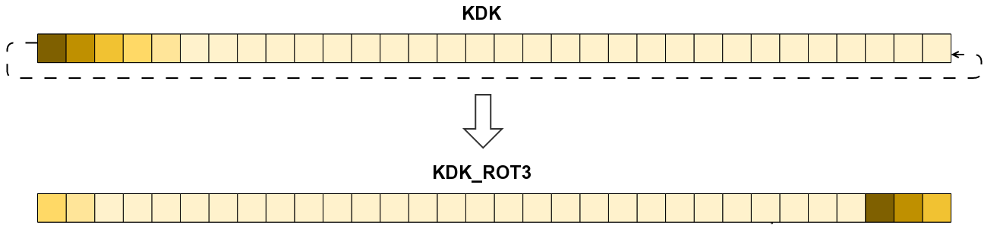

Wi-Fi Peculiarities
===================

DRC communicates with DRH using 5GHz 802.11n. Pairing uses a slightly modified
version of WPS, normal connection encryption uses a slight modified version of
WPA2.

Pairing
-------

When the console is in GamePad pairing mode (press twice on the SYNC button),
it exposes an open access point named ``WiiU<mac2><mac>_STA1`` (where ``<mac>``
is the adapter MAC address and ``<mac2>`` almost the adapter MAC address). The
GamePad connects to this access point (**TODO**: how does it choose the AP to
connect to?) and initiates a WPS handshake to get the credentials for the
normal communication mode.

Nintendo modified the WPS handshake slightly to obfuscate the protocol: a
normal WPS implementation will not compute the same *AuthKey* and fail at stage
M2. The standard specifies that the AuthKey is computed from ``KDF(KDK)``. In
Nintendo's implementation, *AuthKey* is computed from ``KDF(KDK_ROT)`` where
``KDK_ROT`` is ``KDK`` rotated 3 bytes to the left.

The WPS handhake uses a PIN code which must be the same on console and GamePad.
When pairing, the console displays the first part of the code on the TV screen
using symbols: ♠ = 0, ♥ = 1, ♦ = 2, ♣ = 3. The second part of the PIN is
hardcoded to ``5678``. For example, if the console displays ♠♠♦♣, the PIN is
``00235678``. If you are trying to associate a gamepad to your computer (and
not your computer to a Wii U), you get to choose the code, as long as you enter
the same on the GamePad it should work.

After the WPS handshake is done, you should get the Wii U SSID, BSSID (AP MAC
address) and PSK.

Normal connection and WPA2
--------------------------

In normal operation mode (not pairing), the Wii U exposes a *WPA2-PSK* access
point with an empty SSID. In the beacon frames it broadcasts, the AP advertises
support for these ciphers:

* Pairwise: ``a4:c0:e1`` (Nintendo OUI) AES CCM
* Group: ``a4:c0:e1`` (Nintendo OUI) AES CCM
* Auth key mgmt: ``a4:c0:e1`` (Nintendo OUI) PSK

Note that because these are not the standard RSN algorithms, you may have
trouble getting your supplicant to associate with the AP: it needs to advertise
the support for these algorithms or the Wii U will refuse your connection with
error code 0x000c.

The only difference between the Nintendo Pairwise CCM and the standard pairwise
CCM is a 3 bytes rotation of the ``PTK`` to the left after it's computed.

After that, the GamePad sends a DHCP request and the console answers it with an
IP (default: ``console=192.168.1.10 gamepad=192.168.1.11``).

Analysis tools
--------------

A patched version of Wireshark that has support for the modified Nintendo
ciphers is available on `memahaxx/drc-wireshark`_.

.. _`memahaxx/drc-wireshark`: https://bitbucket.org/memahaxx/drc-wireshark
